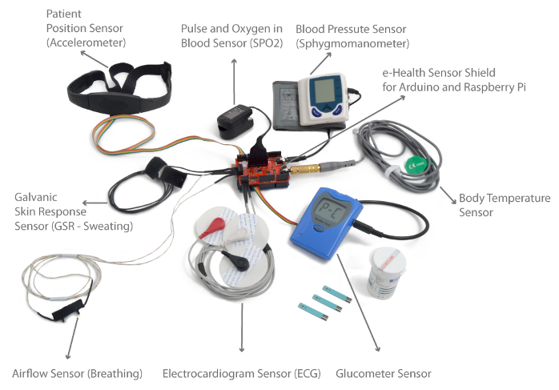

# master_project_freelance
project to sense health for old people and make report if in danger .
sensors that we need for measuring heath  
heart rate -oximeter (Blood Oxygen) - Diabetes Diagnosis- blood pressure - body heat 

> 1- Max30100 - (Blood Oxygen & Heart rate BPM).
> 2- LM35 Temperature Sensor.\

 i think [e-Health Sensor Shield] (https://www.cooking-hacks.com/ehealth-sensor-shield-biometric-medical-arduino-raspberry-pi.html) is agood recomendation 

good resourses and links 
https://sci-hub.tw/https://ieeexplore.ieee.org/document/8226669

https://www.cooking-hacks.com/ehealth-sensor-shield-biometric-medical-arduino-raspberry-pi.html
